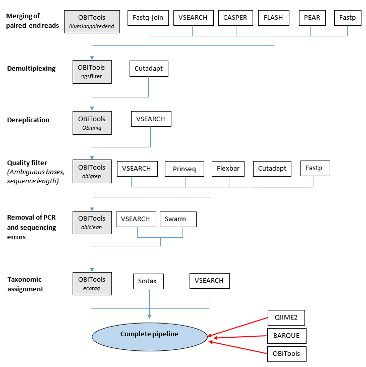

# benchmark_pipelines

Assessment of metabarcoding data pipelines :
The goal of this study is to compare the performance of several bioinformatic tools to analyze fish eDNA data, in order to build the most efficient pipeline.
Seven steps of the analysis were identified, from the assembly of paired-end reads to the taxonomic assignation.
For each of these steps, different programs to compare were identified, as shown below :

For each step, all the programs are compared, while the start and the end of the pipeline are standardized with a reference pipeline ([Script_obitools_reference.sh](Script_obitools_reference.sh)). This pipeline is based on [ObiTools](https://git.metabarcoding.org/obitools/obitools/wikis/home), a set of python programs designed to analyse Next Generation Sequencer outputs (illumina) in the context of DNA Metabarcoding.

The optimal pipeline obtained will be again compared to existant complete pipelines (QIIME2, Mothur, BARQUE, DADA2 and SLIM).

# Dependencies

# Installation

To install all the programs used in this stidy, please follow the instructions on their installation pages : [ObiTools](https://pythonhosted.org/OBITools/welcome.html#installing-the-obitools), [VSEARCH](https://github.com/torognes/vsearch), [USEARCH](https://drive5.com/usearch/download.html), [PEAR](http://www.exelixis-lab.org/web/software/pear), [FLASH](https://sourceforge.net/projects/flashpage/files), [PANDAseq](https://github.com/neufeld/pandaseq), [CASPER](http://best.snu.ac.kr/casper/index.php?name=manual), [EA-util](https://github.com/ExpressionAnalysis/ea-utils/tree/master), [QIIME](http://qiime.org/install/install.html), [cutadapt](https://cutadapt.readthedocs.io/en/stable/installation.html), [Flexbar](https://github.com/seqan/flexbar), [TagCleaner](https://sourceforge.net/projects/tagcleaner/files), [deML](https://github.com/grenaud/deml), [Tally](https://www.ebi.ac.uk/research/enright/software/kraken), [DADA2](https://benjjneb.github.io/dada2/dada-installation.html), [Prinseq](https://sourceforge.net/projects/prinseq/files/), [Trimmomatic](http://www.usadellab.org/cms/index.php?page=trimmomatic), [SWARM](https://github.com/torognes/swarm), [Perseus](https://code.google.com/archive/p/ampliconnoise/), [CATCh](https://github.com/M-Mysara/CATCh), and [PROTAX](https://www.helsinki.fi/en/researchgroups/statistical-ecology/software#section-49869).

The installation guidelines for the complete pipelines can be found here : [QIIME2](https://docs.qiime2.org/2019.4/install), [MOTHUR](https://github.com/mothur/mothur), [BARQUE](https://github.com/enormandeau/barque) and [SLIM](https://github.com/yoann-dufresne/SLIM).

Other possibility : all the programs have been installed in a Singularity container, which you can access here :
But first you need to install [Singularity](https://github.com/sylabs/singularity/blob/master/INSTALL.md).

# Analysis steps

## 1 - Merging paired-end reads

The first step consists in assembling forward and reverse reads of the sequences. We tested several assemblers, with no specific parameters.

[01_merging](01_merging) contains the scripts to run each of these programs.

## 2 - Demultiplexing

Once the reads assembled, the primers are removed (max. 2 mismatches allowed by primers). The tags are also removed (no mismatch allowed) and each read is assigned to the sample it comes from.

[02_demultiplex](02_demultiplex) contains the scripts to run each programs used at this step.

## 3 - Dereplicating

The reads are then dereplicated: identical reads are gathered in a unique read and the count is saved.

All the scripts to run the different programs are in [03_dereplication](03_dereplication).

## 4 - Quality filtering

Reads are then checked for their quality : sequences longer than 20bp and with no ambiguous bases are kept.

The scripts to run the different programs are in [04_quality-filter](04_quality-filter)

## 5 - PCR / Sequencing error removal

Each program or pipeline offers different tools to remove PCR or sequencing errors. For ObiTools, the program obiclean keeps only the head sequences for each PCR replicate.

The scripts for the different programs are in [05_error-removal](05_error-removal).

## 6 - Chimera removal

Several programs are specialized in identifying and removing chimeras. 

[06_chimera-removal](06_chimera-removal) contains the scripts to run these programs.

## 7 - Taxonomic assignation

The last step of the analysis is to assign every sequence to a taxa. In our case, we use a homemade reference database. To be assigned at the species level, the query sequence must be at least similar at 98% to the reference sequence.

[07_taxonomic-assignation](07_taxonomic-assignation) contains the scripts to run the different assigning programs.

